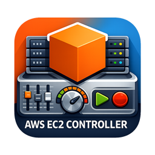
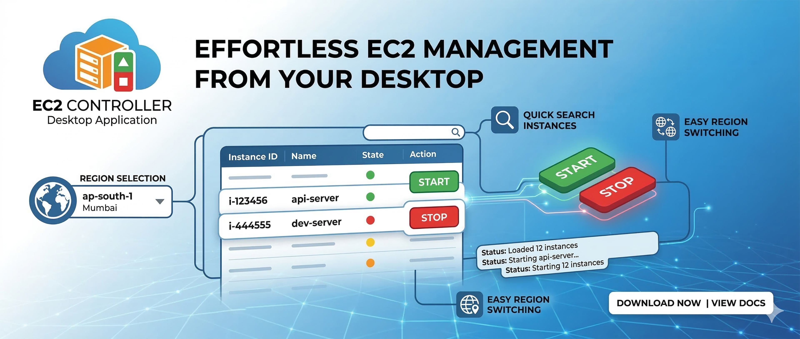
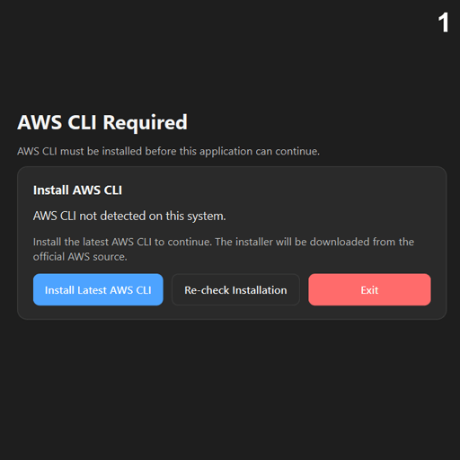

  

  

<h1 align="center">AWS EC2 Controller</h1>

  A modern desktop application to <b>view, manage, start, stop, and monitor AWS EC2 instances</b> with a clean interface built using <b>PySide6</b>.

  
  
  
  
  

---

## Overview

AWS EC2 Controller is a professional Windows desktop app that simplifies EC2 instance management for developers, administrators, and cloud users.

Instead of opening the AWS Console every time, this app gives you a fast and focused way to:

- View EC2 instances in a selected AWS region
- Start and stop instances quickly
- Check live instance status
- Refresh instance data in the background
- Search instances by name or ID
- Work with AWS credentials from a user-friendly interface

The app is designed for users who want a lightweight, clean, and efficient EC2 control panel on their desktop.

---

## Features

- Clean desktop UI built with PySide6
- AWS CLI detection and setup guidance
- AWS credentials validation
- Region selection support
- Start / Stop EC2 instances
- Background refresh for live status updates
- Search and filter instance list
- Startup checks for AWS CLI and credentials
- Professional Windows packaging support with PyInstaller and Inno Setup
---

## Why Use AWS EC2 Controller?

Managing EC2 instances through the browser can be slow for simple day-to-day tasks.
AWS EC2 Controller provides a faster workflow with a dedicated desktop experience.

Ideal for:
- Users managing test AWS servers
- Teams that frequently start and stop EC2 instances
- Users who want a lightweight EC2 dashboard
- Personal AWS environments where quick access matters
---

## Tech Stack

- Python
- PySide6
- AWS CLI
- PyInstaller
- Inno Setup
---

## Installation

Download Installer
Download the latest Windows installer from the releases section and install it normally.

---

## AWS Requirements
Example permissions may include:

- ec2:DescribeInstances
- ec2:StartInstances
- ec2:StopInstances
- sts:GetCallerIdentity
---

## Vision

The goal of AWS EC2 Controller is to deliver a smooth, desktop-first AWS EC2 management experience that is simple, reliable, and fast.

This project focuses on:
- usability
- clean design
- practical EC2 controls
- professional Windows distribution
---

## Author

Jash / GamesBond

---

## Screenshots

  

---

Example:
MIT License
